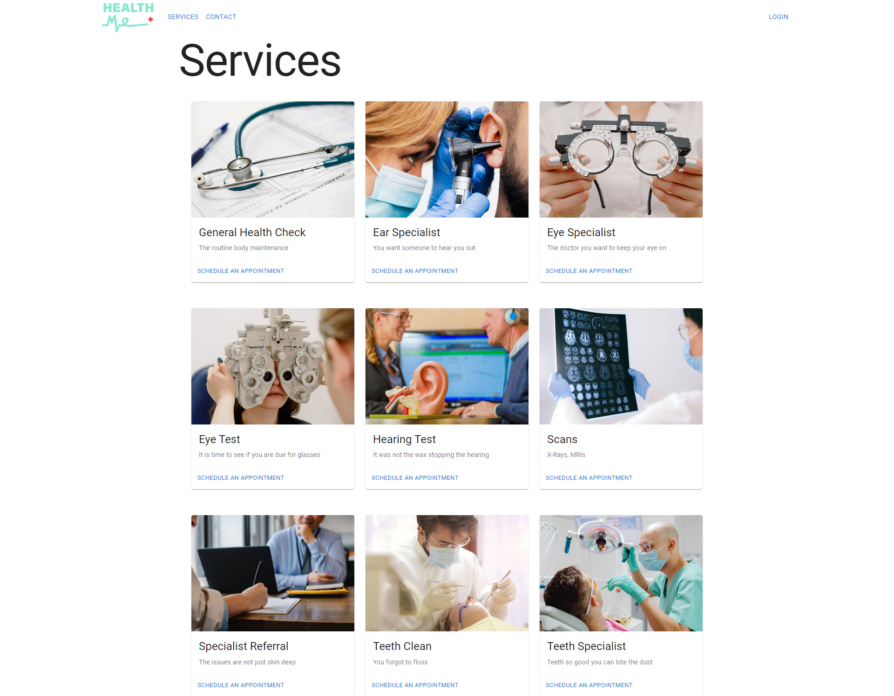

# Health Me

## Description

A full-stack web application where you can book all your health clinical needs in a single location. Select from a variety of clinical services and book a time and date for an appointment.

## Table of Contents

- [Installation](#installation)
- [Usage](#usage)
- [Screenshot](#screenshot)
- [Resources](#resources)
- [License](#license)

## Installation

This application can be run through the browser using the provided link down below. Alternatively, the application can be run locally using the following instrctions:

1. Download or clone this repository
2. [node.js](https://nodejs.org/en) is required for this application
3. `npm i` in the terminal to install the required npm packages
4. `npm run develop` to invoke the application
5. Use the following link to run the application: http://localhost:3000/

## Usage

Acess the application using the following deployed [HERE]([#](https://healthme-c02ea348ef65.herokuapp.com/)).

## Screenshot

This is the general setup of the application.

## Resources

- [Material UI](https://mui.com/)
- [react-dayjs](https://www.npmjs.com/package/react-dayjs)
- [react-number-format](https://www.npmjs.com/package/react-number-format)

## License

Please refer to the LICENSE in the repo.

---
